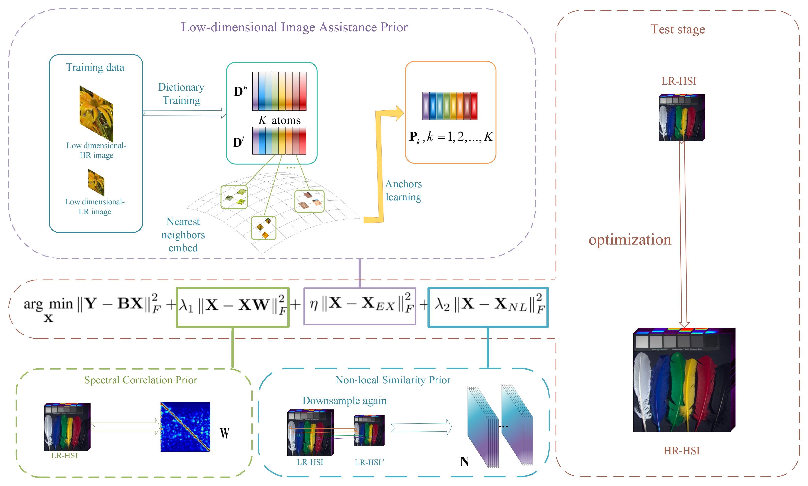

# ISSLDIA
This repository contains the Matlab codes of paper "ISSLDIA: Internal Structure Self-learning and Low Dimensional Image
Assistance for Single Hyperspectral Image Super-Resolution" 
[DOI:https://doi.org/10.1016/j.infrared.2025.105859](https://doi.org/10.1016/j.infrared.2025.105859)
<p align="center">
  
</p>

## Prepare
   1) Please read `./ompbox/readme.txt` and `./ksvdbox/readme.txt` first and follow the steps to setup the ompbox and ksvdbox function tools.
   2) Put your RGB training images anywhere you like.  (you need change the training path in 'Training.m' matfile.)
```
    ├──{your training dataset name}
    |     └── *.{png/jpg/tif/...}      
    |     └── *.{png/jpg/tif/...}
    |     └──  ...
    ----------------------------------------------
```
   We provided two training data sets under `./UCMerced_LandUse/Images/` and `./CVPR08-SR/Data/` 
   in `.zip` format, you can unzip them and put these images under their own folder.
   
   3) Put testing hyperspectral data in '.mat' format under 
```
    ├──Data
    |  └──{your testing dataset name}
    |  |  └── *.mat
    |  |  └── *.mat   
    |  |  └──  ...  (more than one '.mat' file)
    |  └──{your testing dataset name}
    |     └── *.mat   (only one '.mat' file)
    ----------------------------------------------
``` 
## Train 
   Run `./Training.m`
## Test    
   Run `./go_run.m`
## Hyperspectral datasets
  1) [CAVE](https://www.cs.columbia.edu/CAVE/databases/multispectral/)
  2) [Pavia University](https://www.ehu.eus/ccwintco/index.php?title=Hyperspectral_Remote_Sensing_Scenes#Pavia_University_scene)
  3) [Washington DC mall](http://cobweb.ecn.purdue.edu/~biehl/Hyperspectral_Project.zip)
  4) [Chikusei](https://naotoyokoya.com/Download.html)
## Contact  
If you have any question, please email: `ren_jinhao@163.com`
